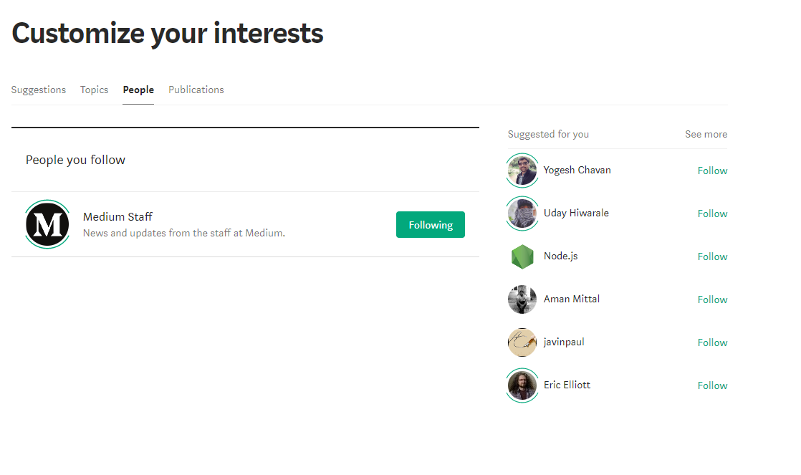

## General Details
This feature allows one user to follow another, increasing the prominence of stories from that user in their personal feed.

## Models

### Users
  * A user should have a list of content by other users that they follow and can see on their feed.
  * Relationships:
    * has many articles they have authored
    * has many other users they have followed
    * *(belongs to many categories through their interests)?*

### Follows
  * A user should be able to follow other users so that their articles will show up in a feed.
  * Relationships:
    * belongs to one follower user
    * belongs to one author user

### Articles
  * An article should be represented in the feed showing a thumbnail, title, byline, author, and date published
  * Relationships:
    * belongs to one user (the author)
    * *(belongs to one category)?*

---

## Endpoints

* /users/:id/follow  -- Follow an existing user.
* /users/:id/unfollow  -- Cease following an existing user.

---

## Templates
  * interests-list.pug
  * interests-new.pug
  * interests-edit.pug

## Wireframes/Sketches

