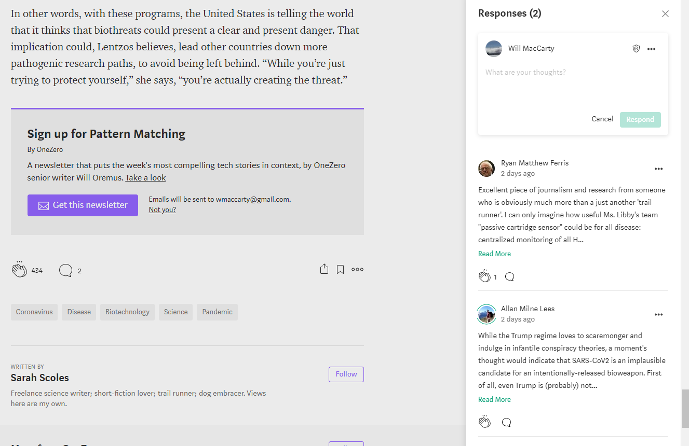

## General Details
The likes feature will allow a user to click the like icon on a story, and have that storyreflect the status change.

## Models

### Users
  * A user should be able to like an article that they connect with / want to remember for later
  * Relationships:
    * has many likes which each reference a specific article

### Articles
  * An article should be represented in the feed showing a thumbnail, title, byline, author, and date published
  * Relationships:
    * has many likes which each reference a single user

### Likes
  * A like should be created whenever a user "likes" an article and should be deleted whenever the user clicks the "like" button again
  * Relationships:
    * belongs to one user who created the like
    * belongs to one article
  * TODO: decide if we want to just delete on "unlike" or if we would rather have a "deleted" column on the likes table

---

## Endpoints

* /posts/:id/like    -- Like a story.
* /posts/:id/unlike  -- Un-like a story.

---

## Templates
  * reactions-new.pug
  * reactions-edit.pug

## Wireframes/Sketches

